# XBolo

This is a set of instructions for XBolo. It was pretty much ripped from the original game's instructions. Some portions have been omitted as they do not apply to this version.

## The Game
The game of Bolo is a tank battle set on an island, for up to 16 players, using separate computers and monitors, so that each cannot see what the others are doing. This enables players to lay minefields which others cannot see, and to hide under the cover of forest and watch (or ambush) other players without being seen.

Another important factor of Bolo is that it is not a two player game, where your objective is to kill your single enemy, but a multi-player game, where you can work as teams. In this game you are not alone when you find yourself cornered by the enemy - you can shout for help, and have your allies break cover and come out of the forest shooting, to wipe out your attackers and rescue you.

## Driving the Tank
XBolo's default settings are pretty abysmal. I would suggest remapping your keys to match the layout of the original.

# XBolo

This is a set of instructions for XBolo. It was pretty much ripped from the original game's instructions. Some portions have been omitted as they do not apply to this version.

## The Game
The game of Bolo is a tank battle set on an island, for up to 16 players, using separate computers and monitors, so that each cannot see what the others are doing. This enables players to lay minefields which others cannot see, and to hide under the cover of forest and watch (or ambush) other players without being seen.

Another important factor of Bolo is that it is not a two player game, where your objective is to kill your single enemy, but a multi-player game, where you can work as teams. In this game you are not alone when you find yourself cornered by the enemy - you can shout for help, and have your allies break cover and come out of the forest shooting, to wipe out your attackers and rescue you.

## Driving the Tank
XBolo's default settings are pretty abysmal. I would suggest remapping your keys to match the layout of the original.

| Left Hand             |       |
|-----------------------|-------|
| Accelerate            |   Q   |
| Decelerate            |   S   |
| Fire Tank             | Space |
| Lay Mine              |  Tab  |

| Right Hand            |       |
|-----------------------|-------|
| Turn Counterclockwise |   O   |
| Turn Clockwise        |   P   |
| Increase Gun Range    |   L   |
| Decrease Gun Range    |   ;   |
| Tank View             | Enter |
| Pillbox View          |   '   |

## Beginning the Game
When you start the game, your tank is out at sea, on boat. You should head towards the island and drive off the boat onto the land. You may have to be going quite quickly to leave the boat.

Boats can sail up rivers, but not under the low floating bridges which are laid by tanks. To pass a bridge you must either leave the boat and proceed on land or shoot the bridge to destroy it. Do not rely too much on boats as they are extremely vulnerable - they are sunk by a single hit. If you are on a boat when this happens you will be dumped into the water and will be at the mercy of your attacker. If you are out in 'Deep Sea' (water shown with dark ripples in it) then your tank will sink and be destroyed immediately - so take care!

## Terrain
On the island you will encounter different kinds of terrain and obstacles which have different properties.

| Terrain | Name | Top Speed | Special Notes |
|---------------------------------|----------|-------------------------------------|-----------------------------------------------------------------------------------------------------------------|
|  | Grass | Medium | Most of the island is covered with grass. |
|  | Water | Very slow (except when on a boat) | If you stay in water for too long (without a boat) then the tank's stocks of shells and mines will be depleted. |
|  | Deep Sea | Instant death (except when on a boat)   | If you stay in water for too long (without a boat) then the tank's stocks of shells and mines will be depleted. |
| 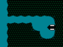 | Moored Boat | Fast | You can drive your tank onto moored boats to travel quickly by river and sea. |
| 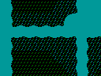 | Swamp | Very Slow | Swamp is usually found in areas near to water. It looks quite similar to normal grass, but will bog your tank down, so watch carefully where you go. |
| 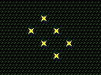 | Mine | | You can lay mines on any terrain (except buildings, boats or water) and they will explode and damage any tank which goes over them. |
| 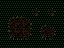 | Crater | Very Slow | Exploding mines leave craters in the ground. Craters adjacent to water will flood. You can make use of this to build artificial waterways, both for transport by boat and for defensive purposes. |
| 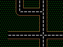 | Road | Fast | Build roads where you expect to travel frequently. |
| 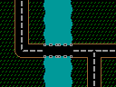 | Bridge | Fast | Build bridges over rivers you expect to have to cross frequently so that you won't lose shells and mines by driving through the water every time. |
| 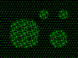 | Forest | Slow | If your tank is completely enclosed in forest, surrounded on all sides, then other players and pillboxes will not be able to see you. Forest also provides the source of building materials. |
|  | Buildings | None (barrier) | 	You can build buildings to make a barrier and provide cover from enemy fire. |
| 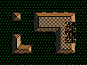 | Damaged Building | None (barrier) | If you shoot a building then it becomes damaged. |
| 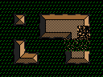 | Damaged Building | Very Slow | If you shoot a building repeatedly then you can reduce it to rubble which you can drive over, but only very slowly. |
| 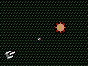 | Pillbox | None (barrier) | Pillboxes shoot at any enemy tanks which come into range. You can capture them to make them loyal to yourself, so that they will shoot your enemies for you. |
|  | Damaged Pillbox | None (barrier) | When you shoot a pillbox, it becomes damaged. You can estimate how damaged it is from its appearance on the screen. |
| 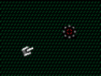 | Dead Pillbox | Medium | If you completely destroy a pillbox, then it becomes inactive and you can drive over it to pick it up. |
|  | Refueling Base | Medium | Refueling bases provide your tank with more shells, mines and armour. |

## Pillboxes
Once on land you will encounter automatic pillboxes which shoot at any enemy tank which comes within range. They are very accurate, and, when provoked, can fire very rapidly, so beginners should think twice before carelessly attacking one. In a straightforward confrontation, with a tank and a pillbox both firing at each other as fast as they can, a pillbox will win every time. To destroy a pillbox requires more subtlety. You must attack it quickly, score a few good hits, and then turn and run to get out of range before it has time to destroy you. Be patient, stay away from pillboxes unless you have full armour, and always remember the option of hiding in the forest when confronted by pillboxes or hostile players. Remember also that there is no reason why you should kill a pillbox in one go - after damaging it, you can go to a refueling base to replenish your shells and armour, and then come back to finish it off.

Pillboxes can never be totally destroyed, just disabled. When you are confident enough, you should try to do this, because then you can drive over the pillbox and pick it up. It will be repaired, and will become loyal to you and your allies. Later, when a suitable location is found, it can be placed back onto the map (see "Farming and Building" below) and left to attack enemy tanks. This is the key to the game - not fighting the other players yourself - but claiming a territory for yourself and using the pillboxes to defend it against other players.

## Refueling Bases
Tanks enter the game with limited shells and mines, so the first thing you must do before you can attack pillboxes or other tanks is find a refueling base to replenish the tank's supplies of shells, mines and armour. Most bases are defended by nearby pillboxes, but there are a few which are isolated and easily accessible - it is up to you to explore the map and find them.

On the right of the screen you will see an indication of the stocks of shells, mines and armour of the nearest refueling base to your tank (if there is one nearby). When you drive onto the base, you will see the stocks go down as your tank is refueled. The base will slowly replenish its stocks automatically. The base will also be automatically captured, and will become loyal to you and your allies. An enemy tank cannot drive onto your base to refuel, although it can shoot your base and deplete the armour that it has. When the armour is all gone, there is nothing to stop the enemy tank from driving onto your base and capturing it.
The object of the game is, eventually, to have captured all of these refueling bases.

## Farming and Building
| Symbol | |
|-------------------------------------------|------------|
| 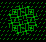 | Farm Trees |
| 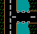 | Build Roads or Bridges |
| 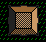 | Build Buildings or Boats |
| 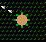 | Place or Repair Pillbox |
| 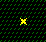 | Lay Mine |

To build, first select the mode you require by clicking on the appropriate button on the left side of the screen, and then click on the map.

A man will leave the tank, run to the square, build the required object, and return to the tank. <u>You can only build if you have sufficient building resources</u>>, so you will need to farm trees first before you can build anything. Building a **road** or **bridge** or **building** costs you 1/2 a tree from the tank inventory and building a **pillbox** requires a whole tree. **Boats** are expensive - they cost five trees to build.

Some other restrictions: You cannot build on deep sea, on a moored boat, or on forest (farm it or shoot it down first).

You can also repair a damaged pillbox by selecting 'Pillbox mode' and putting the cursor on top of it. Instead of putting down another pillbox, the man will repair the one which is already there - even if it belongs to someone else, although you probably won't want to do this normally. He may take up to whole tree, depending on how damaged the pillbox is.

Laying mines this way is an alternative to using 'Quick' mines. It does take slightly longer, but has the advantages that you don't actually have to drive the tank to the place to lay the mine, and that the mines you lay are invisible even if someone is watching you while you do it.

Your computer informs your allies' computers whenever you lay mines, so that they can be marked on their maps. Once they are marked, they are never erased, even if you break the alliance. Of course, any mines you lay after the alliance is broken are not shown on their maps, nor are any you laid before the alliance was formed - only those laid during the time you were actually in the alliance.

If the man gets shot by another player while outside the tank, you will not be able to build any more. A new man will be parachuted in for you, but this may take several minutes, during which time you will not be able to build anything. Forests grow all the time, so trees you farm will be replenished slowly.

## Aliances
At first, when you capture a pillbox for yourself, it will shoot at all other players. When there are several people playing, one person does not have much chance of winning on his own, so you will want to work as a team with some of your friends. So that your pillboxes know not to shoot at your friends, a formal alliance must be declared. To do this:

1. Select a person whose alliance you would like to join on the "Players" menu and select "Request Alliance" on the "Bolo" menu.
2. If agreeable, that person should then select your name on their "Players" menu and then select "Request Alliance" or "Invite New Allies".

If you are in an alliance, the menu choices are "Invite New Allies" and "Leave Alliance". If you are not, then the menu choices are "Request Alliance" and "Cancel Request". Take care that you have the correct players selected on the "Players" menu when requesting/inviting.

If you are already in an alliance, you must select "Leave Alliance" first before you can join someone else's. Members of an alliance can also see each other's mines as they are layed, (this does not apply to mines layed before the alliance was formed - they remain secret.)

At any time, a player may opt to leave the alliance simply by selecting "Leave Alliance" and he is then on his own. Any pillboxes he is carrying at the time are his, but any active ones on the map remain with the members of the alliance.

Any member of the alliance may also invite a new member in at any time. To do this, the newcomer must select "Request Alliance" first. The alliance member selects "Invite New Allies" to bring in the new member.

If two people decide that they wish to 'go it alone' and break free from their previous alliances then they should **both** leave their old alliance(s), and then both select "Request Alliance" to begin a new alliance.

<u>**Note**</u>: Once you have selected "Request Alliance" you become eligible to join an alliance. If you change your mind then you should select "Cancel Request" to prevent another player from making you an involuntary ally.

## Building a Fortress
Players should pick a location in which to build a home base. The art of building a secure fortress is an important skill to be learned, and different players favour many different design strategies, but one common feature is that all bases rely on pillboxes for defence. Care must be taken in the placement of pillboxes so that they give each other adequate covering fire (a pillbox left alone at the corner of a base will be picked off easily by attackers) but they must not be placed too close or they risk hitting each other by accident when firing at the enemy.

Other common features of fortresses are thick walls of buildings around the edge, large areas of Tar-Mac in the centre, and invisible minefields hidden around the approaches. Minefields are invisible to everyone except the player who laid them and his allies.

When mines explode, they leave craters which will slow down any tank which tries to drive through them. An exploding mine will also set off any adjacent mines - so a long line of mines will all go off together in a chain reaction. If you don't want this to happen, you must lay mines in a checker-board pattern so that they don't set each other off. Craters adjacent to sea or river will flood with water, so setting off a long line of mines leading to the sea will have the effect of creating an artificial river. Using this method, you can create a moat around your fortress. As well as slowing down tanks, water also damages any shells and mines carried by the tank, so any tank caught in your moat will soon be helpless. Players may also take advantage of natural features such as swamps around the base to slow down the approach of attackers. Forest slows down the approach of tanks too, but this benefit is more than outweighed by the fact that tanks cannot be seen whilst they are under the cover of trees, and this enables enemy tanks to make surprise attacks. This means that a fortress surrounded by forest is extremely vulnerable. Unfortunately, you need forest in order to get the raw materials you need for making buildings, bridges and roads, so a fortress positioned well away from the nearest forest is also vulnerable because you will not be able to make the necessary repairs to keep it secure.

## Mine Laying
You can lay mines in two different ways - by sending the man out to bury them (as described in "Farming and Building" above) - or by just dropping them onto the ground where the tank stands by pressing the "Tab" key. This can be quicker, but all other tanks which are near to you will see mines that you lay this way. If you're out of shells and low on armour and being chased along the road by an enemy tank, remember this. Don't assume that you can kill him just by dropping mines in his path, because he will see mines you lay this way and will be able to avoid them.
